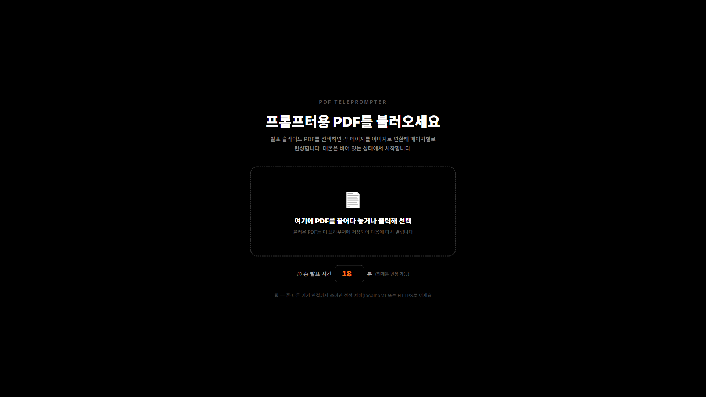
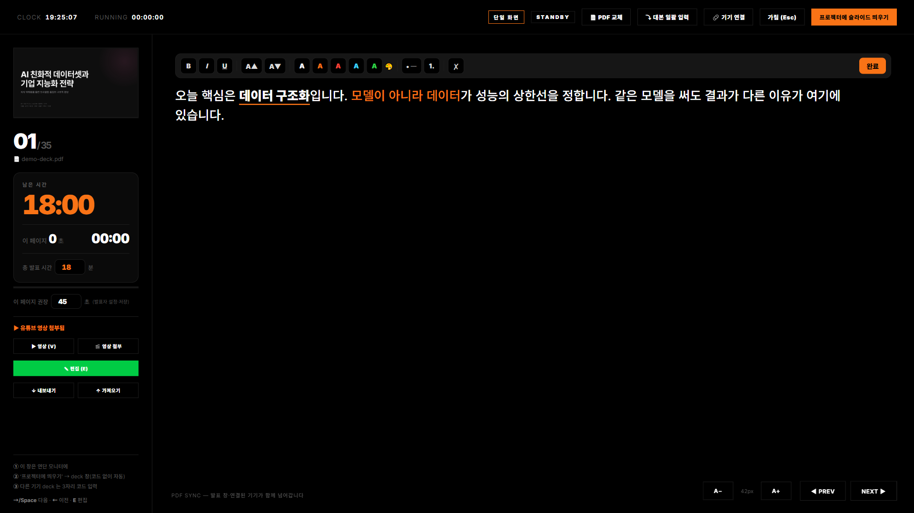
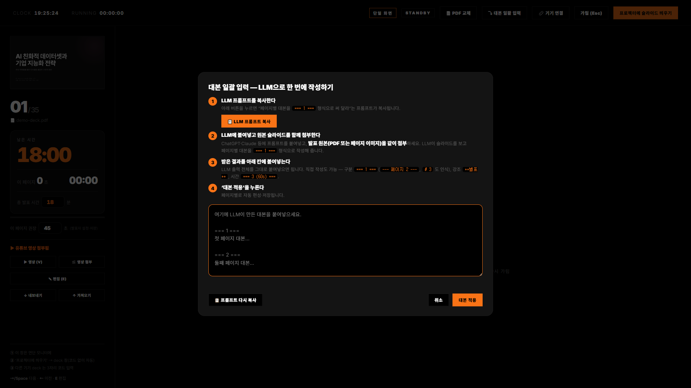
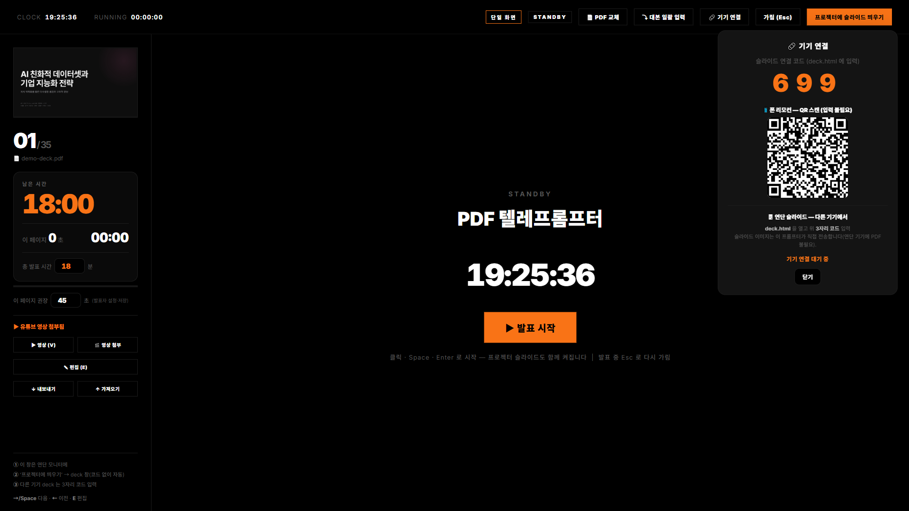
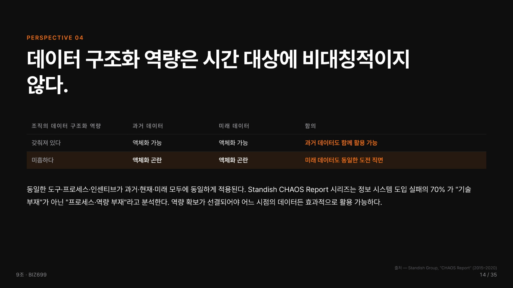

# 🎤 PDF 텔레프롬프터

**발표 PDF 하나만 넣으면, 발표에 필요한 세 가지가 한 번에 준비됩니다.**
발표자 노트북에는 **대본과 타이머**, 프로젝터에는 **슬라이드**, 손에는 **휴대폰 리모컨** — 따로 맞출 필요 없이 자동으로 연결됩니다.

🔗 **바로 사용하기 (설치 필요 없음):** https://bizsinsightclub.github.io/prompter/

---

## 왜 만들었나요?

발표를 하다 보면 늘 이런 번거로움이 있습니다.

- 슬라이드는 프로젝터에 띄워야 하는데, **대본과 남은 시간**은 어디에 띄우지?
- 발표자료는 이미 **PDF로 완성**돼 있는데, 거기에 대본·타이머·리모컨을 따로 붙이기가 어렵다.
- 발표장(학교·회사) 와이파이에서 화면 공유나 연결이 잘 안 꼬인다.

이 앱은 **PDF 한 장만 올리면** 이 모든 걸 알아서 묶어줍니다. **설치도, 회원가입도, 서버도 필요 없습니다.** 인터넷 브라우저(크롬·엣지)만 있으면 됩니다.

## 무엇이 특별한가요?

| | 설명 |
|---|---|
| 📄 **어떤 발표든 OK** | 슬라이드를 PDF로 내보내 올리기만 하면 됩니다. 특정 발표 내용이 앱에 박혀 있지 않아, 매번 새 발표에 재사용할 수 있습니다. |
| 🤖 **대본을 AI로 한 번에** | 버튼 한 번이면 "페이지별 대본을 써 줘"라는 명령문이 복사됩니다. ChatGPT 같은 AI에 붙여넣고 슬라이드를 첨부하면, 페이지별 대본이 자동으로 채워집니다. |
| 🖥 **연단 컴퓨터에 파일을 안 보내도 됨** | 발표자 노트북이 현재 슬라이드 **그림을 직접 쏴 주기** 때문에, 프로젝터를 연결한 다른 컴퓨터에 PDF를 옮길 필요가 없습니다. |
| 🔢 **와이파이에서도 안전한 연결** | 복잡한 설정 대신 화면에 뜬 **3자리 숫자**만 입력하면 연결됩니다. |
| ⏱ **시간 관리 & 영상** | 총 발표 시간과 페이지별 권장 시간을 정해두고, 특정 페이지에 **유튜브·동영상(mp4)**을 끼워 넣을 수 있습니다. |

---

## 1분 만에 시작하기

1. **발표자 노트북**에서 위 링크를 엽니다.
2. **발표 PDF를 끌어다 놓고**, 총 발표 시간(분)을 입력합니다.
3. (선택) 대본을 직접 쓰거나, **AI로 한 번에** 만들어 붙여넣습니다.
4. 오른쪽 위 **‘프로젝터에 슬라이드 띄우기’**를 누릅니다 → 큰 화면엔 슬라이드, 노트북엔 대본·타이머가 뜹니다.
5. 휴대폰으로 넘기고 싶다면 **‘기기 연결’**의 QR을 스캔하세요.

> 💡 휴대폰·다른 기기 연결까지 쓰려면 위 **https 주소(GitHub Pages)** 로 여는 것이 가장 안정적입니다.

---

## 화면 살펴보기

### 1) 시작 화면 — 발표 PDF 넣기
PDF를 끌어다 놓으면 각 페이지가 슬라이드로 만들어집니다. 여기서 **총 발표 시간**도 정합니다. (한 번 올린 PDF는 이 브라우저에 저장되어 다음에 자동으로 다시 열립니다.)



### 2) 발표자 화면 — 대본·타이머·리모컨이 한곳에
발표 중 발표자만 보는 화면입니다.
- **왼쪽:** 현재 슬라이드 미리보기 · 파일 이름 · 큰 **남은 시간** 타이머 · **총 발표 시간**과 **이 페이지 권장 시간**(직접 조절) · 영상 첨부.
- **오른쪽:** 대본. **워드처럼** 굵게·기울임·밑줄·글자 크기·**글자색**·목록을 지정할 수 있습니다.
- **위쪽 바:** PDF 교체, 대본 일괄 입력, 기기 연결, 가림, 프로젝터에 띄우기.



### 3) 대본을 AI로 한 번에 만들기
‘대본 일괄 입력’ 창에는 **4단계 안내**가 있습니다: ① 프롬프트 복사 → ② AI에 붙여넣고 슬라이드 첨부 → ③ 결과 붙여넣기 → ④ 적용. 페이지별로 자동으로 나뉘어 들어갑니다.



### 4) 기기 연결 — 휴대폰 & 프로젝터
‘기기 연결’을 누르면 **3자리 숫자**와 **QR 코드**가 나옵니다. 휴대폰은 QR만 찍으면 바로 연결되고, 다른 컴퓨터를 연단 화면으로 쓰려면 그 컴퓨터에서 화면을 열고 3자리 숫자를 입력합니다.



### 5) 연단 슬라이드 (프로젝터 화면)
프로젝터에 띄우는 전체 화면입니다. 발표자가 페이지를 넘기면 함께 넘어갑니다.



---

## 기능 자세히 보기

### 대본 쓰기
- **직접 편집** — 대본 영역을 누르거나 `E` 키로 편집. 워드처럼 서식을 줄 수 있고, 입력하면 자동 저장됩니다.
- **AI로 한 번에** — 위 ‘대본 일괄 입력’ 참고. (직접 쓸 때는 페이지를 `=== 1 ===` 으로 구분, 강조는 `**별표**`)
- **백업/옮기기** — ‘내보내기’로 파일(JSON) 저장, ‘가져오기’로 다른 컴퓨터·브라우저에 복원.

### 시간 관리
- **총 발표 시간** — 시작 화면이나 타이머 아래에서 분 단위로 설정. 큰 글씨로 **남은 시간**이 카운트다운됩니다.
- **페이지별 권장 시간** — 페이지마다 “이 페이지 권장 N초”를 직접 정할 수 있습니다. 너무 오래 머물면 막대가 빨갛게 표시됩니다.

### 페이지에 영상 넣기
‘영상 첨부’로 **유튜브 링크**나 **내 동영상(mp4)**을 페이지에 붙입니다. 발표 중 **`V` 키(또는 ▶ 영상 버튼, 리모컨)**를 누르면 슬라이드 위에 영상이 전체 화면으로 재생되고, 닫으면 슬라이드로 돌아옵니다.
- 유튜브는 어느 기기에서나 재생됩니다.
- 내 mp4는 **발표자 노트북과 같은 컴퓨터**의 프로젝터 화면에서 재생됩니다(다른 컴퓨터에서는 유튜브를 권장).

### 화면 연결 — 상황별로
- **노트북 1대 + 프로젝터(HDMI 등)** — ‘프로젝터에 슬라이드 띄우기’만 누르면 됩니다. 숫자 입력도 필요 없습니다.
- **프로젝터가 다른 컴퓨터에 연결돼 있을 때** — 그 컴퓨터에서 연단 화면을 열고 **3자리 숫자**를 입력합니다.
- **휴대폰 리모컨** — ‘기기 연결’ QR을 스캔. 이전/다음·가림·영상 버튼과 함께, 휴대폰에서도 남은 시간과 대본을 볼 수 있습니다. (블루투스 리모컨의 페이지 넘김 버튼도 동작)

---

## 단축키 (발표자 화면)
`→ / Space` 다음 · `←` 이전 · `+/−` 글자 크기 · `E` 대본 편집 · `V` 영상 재생/닫기 · `Esc` 영상 닫기·화면 가림 · `Home/End` 처음/끝 · 대본 영역 **왼쪽/오른쪽 클릭**으로 이전/다음.

## 잘 안 될 때
- 휴대폰·다른 기기가 연결되지 않으면, **세 기기를 같은 와이파이(또는 휴대폰 핫스팟)** 에 두세요. 가장 확실합니다.
- 노트북 1대로 프로젝터를 쓰는 경우는 **인터넷 연결이 전혀 필요 없습니다.**
- 화면이 안 뜨면 위 **https 주소**로 다시 열어 보세요.

---

## 개발자용 메모
정적 웹앱(HTML·CSS·JS)이라 빌드 도구가 없습니다.

```bash
# 로컬에서 실행
python -m http.server 8080      # 또는: npx serve -l 8080 .
# → http://localhost:8080/
```

```
prompter.html   발표자 화면(메인)        index.html  → prompter.html 로 이동
deck.html       연단 슬라이드(프로젝터)   .nojekyll   GitHub Pages 설정
remote.html     휴대폰 리모컨
js/  config.js · pdf-render.js · sync.js · notes.js
css/ app.css      docs/ 스크린샷
```

- PDF→이미지 변환은 브라우저에서 **pdf.js**로 처리하고, 마지막 PDF는 IndexedDB에 저장됩니다.
- 같은 컴퓨터의 두 화면은 **BroadcastChannel**, 다른 기기는 **PeerJS(WebRTC) + 3자리 코드**로 연결됩니다. 슬라이드는 발표자 화면이 이미지(기본 2560px JPEG)로 전송합니다.
- 다른 발표에 재사용: `js/config.js`의 제목·기본 시간 정도만 바꾸면 됩니다.
